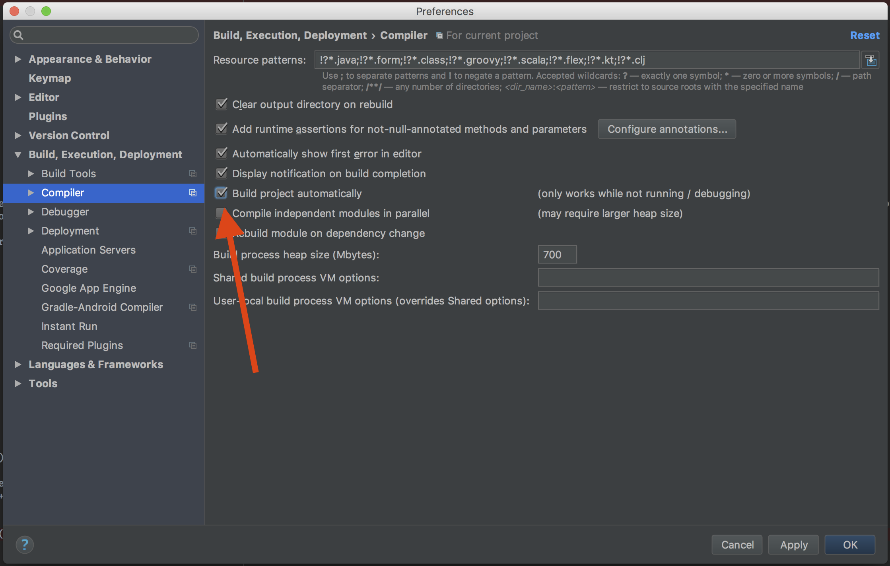
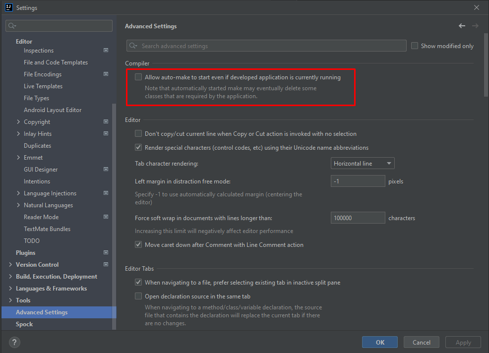
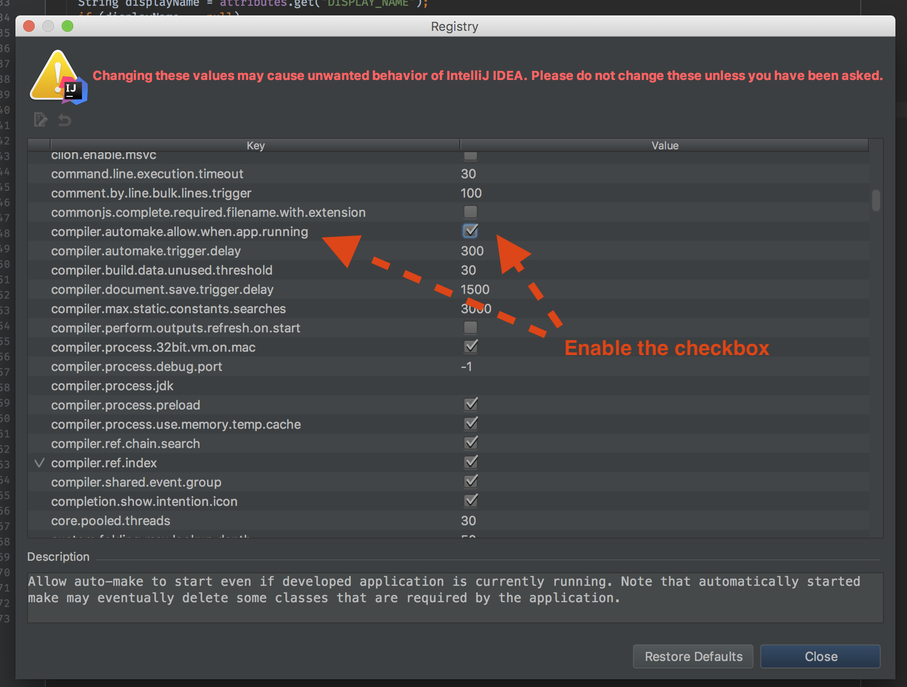

**here we have my journey of learning Spring boot**

_after adding by copy pasting press maven icon on top right of pom.xml file to download that_

first we created dependencies :

1. spring web
2. spring boot Devtool
3. h2                    : for dgl
4. jpa                   : for data base  (instal plugin : Jakarta EE: Persistence ​(JPA))
5. validation     
6. lombok                 (but I added it by adding external library .jar) (add <Bulid> <plugings> ... <plugings> <Bulid> part too if you want to add this by dependency)
7. mysql                   (but i write it by myself) [https://spring.io/guides/gs/accessing-data-mysql/](https://spring.io/guides/gs/accessing-data-mysql/)
************************************************************************************************************************
use this in application.properties ti change th port:

    server.port = 800 
************************************************************************************************************************

**annotations Hint**

* if you use annotation it means you  add all its local annotations 

* instead of adding **@Component** and below that **@controller**
you can have only **@controller** 
because
in **@controller** annotation class @controller have **@component** and by just adding **@controller** you add its pre-defined
annotation like @Component

* **@RestController** is annotation and if you open that by ctrl+click you see these annotations
so you can create rest API
**@Target(ElementType.TYPE)**  
**@Retention(RetentionPolicy.RUNTIME)**  
**@Documented**   
**@Controller**   
**@ResponseBody**     

* of curse, we don't see @Component but in last example we said **@Controller** has **@component** so
by declaring **@RestController** we have its local annotation and ANNOTATION OF ITS LOCAL ANNOTATIONS

* @RequestMapping(value = "/e",method = RequestMethod.GET) is annotation that is used to have Get operation in bakend
  value = "/(your defined path)" , method = RequestMethod.GET / POST / DELETE / HEAD / PUT / ...
for having GET you can use 
@GetMapping"/(your defined path)" == @RequestMapping(value = "/e",method = RequestMethod.GET)
@PostMapping"/(your defined path)" == @RequestMapping(value = "/e",method = RequestMethod.POSt)
...    

**@Component**   
//if you want to have this class as component have this annotation
be careful if you want to scan this by special class add **@ComponentScan** to that class

**@Entity**
this annotaion let this class contract with jpa and can contact with database

**@Autowired**
this attaches to the particular reference

**@RequestBody**    
Default is true, leading to an exception thrown in case there is nobody content.
Switch this to false if you prefer null to be passed when the body content is null.
without this we should to lots of thing manually but with this json object return to department automatically

************************************************************************************************************************

**problem solution**

i had error in my pom.xml file with

    <build>
        <plugins>
            <plugin>
                     <groupId>org.springframework.boot</groupId>
                    <artifactId>spring-boot-maven-plugin</artifactId>
                </plugin>
        </plugins>
    </build>

so I add
    
    <version>${project.parent.version}</version>

in that so ia have this:

    <build>
    		<plugins>
    			<plugin>
	    			<groupId>org.springframework.boot</groupId>
	    			<artifactId>spring-boot-maven-plugin</artifactId>
	    			<version>${project.parent.version}</version>
	    		</plugin>
	    	</plugins>
	    </build>

but it fixed and i don't know how

********************************
**for activating runtime and parallel execution do this:**     
For IntelliJ IDEA 12+ releases we can build automatically the edited sources if we are using    
the external compiler option. The only thing needed is to check the option "Build project   
automatically", located under "Compiler" settings:   

Also, if you would like to hot deploy, while the application is running or 
if you are using spring boot devtools you should enable the compiler.automake.allow.when.app.running from registry too. This will automatically compile your changes.

For versions greater than 2021.2, we need check 'Allow auto-make t o 
start even id the development application is currently running' option:

and 

for old version use this:

solution of this in :
https://stackoverflow.com/questions/12744303/intellij-idea-java-classes-not-auto-compiling-on-save

********************************
