# **here we have my journey of learning Spring boot**

_after adding by copy and pasting press maven icon on top right of pom.xml file to download that_

## first we created these dependencies :

### 1. spring web

### 2. spring boot Devtool

### 3. h2                    : for dgl

### 4. jpa                   : for data base  (install plugin : Jakarta EE: Persistence ​(JPA))

### 5. validation     

### 6. lombok 
(but I added it by adding external library .jar)
(add 
<Bulid> <plugings> ... <plugings> <Bulid>
part too if you want to add this by dependency, and you can copy past that from pom.xml or start.spring site)

### 7. mysql                   

#####  (but I write it by myself) [https://spring.io/guides/gs/accessing-data-mysql/](https://spring.io/guides/gs/accessing-data-mysql/)   
##### "Convert YAML and Properties file" plugin is installed
##### I use this site to convert the properties to yml format :https://www.javainuse.com/app2yaml
##### MAKE SURE YOU DON'T HAVE ANOTHER yml OR .properties FORMAT FILE IT CHANGE THE FILE FORMAT AND THE STRUCTURE
##### and you lose your comments when you use that plugin
     
### 8. actuator                   
if you want to monitor your  application    
or if you want to know how your application performing   
or if you want to how particular application healthy   
or what are different beans created    
or what are different objects created    
use this dependency    

### postgresql : (for sql data base i think)
and  if it works correctly you see this in your console:
###### Exposing 1 endpoint(s) beneath base path '/actuator'
and add the path to the end of *localhost:(your port)/actuator*   

************************************************************************************************************************
use this in application.properties ti change th port:

    server.port = 800 

if you want to change  the server port in application.yml use this format
    `server:
      port: 800`
************************************************************************************************************************

# **annotations Hint**

* if you use annotation it means you  add all its local annotations 

* instead of adding **@Component** and below that **@controller**
you can have only **@controller** 
because
in **@controller** annotation class **@controller** have **@component** and by just adding **@controller** you add its pre-defined
annotation like @Component

### **@RestController**  

is annotation and if you open that by ctrl+click you see these annotations,
so you can create rest API
**@Target(ElementType.TYPE)**  
**@Retention(RetentionPolicy.RUNTIME)**  
**@Documented**   
**@Controller**   
**@ResponseBody**     

* of curse, we don't see @Component but in last example we said **@Controller** has **@component** so
by declaring **@RestController** we have its local annotation and ANNOTATION OF ITS LOCAL ANNOTATIONS

### **@RequestMapping(value = "/e",method = RequestMethod.GET)**
is annotation that is used to have Get operation in backend

####   value = "/(your defined path)" , method = RequestMethod.GET / POST / DELETE / HEAD / PUT / ...

for having GET you can use 
@GetMapping"/(your defined path)" == @RequestMapping(value = "/e",method = RequestMethod.GET)
@PostMapping"/(your defined path)" == @RequestMapping(value = "/e",method = RequestMethod.POSt)
...    

### **@Component**   
//if you want to have this class as component have this annotation
be careful if you want to scan this by special class add **@ComponentScan** to that class

### **@Entity**
this annotation let this class contract with jpa and can contact with database

### **@Autowired**
this attaches to the particular reference

### **@RequestBody**
Default is true, leading to an exception thrown in case there is nobody content.
Switch this to false if you prefer null to be passed when the body content is null.
without this we should to lots of thing manually but with this json object return to department automatically

### **@PathVariable**
if you want to get some value not in local code text of your local code editor anything else
,and you want to get value from link of http or from for example searching in browser 
or insomnia or postman you can declare that in the link in  `{}` and your program 
inform it is special like `"/d/d/{id}"` in this example `d\d\` is not special but 
becuase we store id in `{id}` we can get the value that search in the link
 if you want to get put the value in variable in code and program use the before declaring 
parameter:      
`public void putMapping(@PathVariable("id") Integer id){`
and the value as id store in your parameter of method ,and you can use that

### **@PropertySource** or **@PropertySources**
sometimes we have extra files as `.properties` or `.yml` but spring just scan `application.yml` or `application.properties`
but if you want to create your own file in `src/main/resources` in `.properties` or `.yml` format but spring WILL NOT scan that you should use annotation to inform
spring to scan that.For doing that you should use **`@PropertySource`**  **`@PropertySources`** IN RIGHT PLACE
if you have just one file use **`@PropertySource`** and use this as this way

    @PropertySource("classpath:(filename with right format)")
or
    
    @PropertySource("(filename with right format)")

example:

    @Service
    @PropertySource("classpath:custome.properties")
    public class MyFirstService {...

if you have more than one file use **`@PropertySources`** and use this as this way

    @PropertySources({
    @PropertySource("classpath:(filename with right format)"),
    @PropertySource("classpath:(filename with right format)")
    })

**DON'T FORGET `{}`**

example: 

    @Service
    @PropertySources({
    @PropertySource("classpath:custome.properties"),
    @PropertySource("classpath:hhh.properties")
    })
    public class MyFirstService {

************************************************************************************************************************
# Spring HINT:
 if you want to create bean object with java classes :

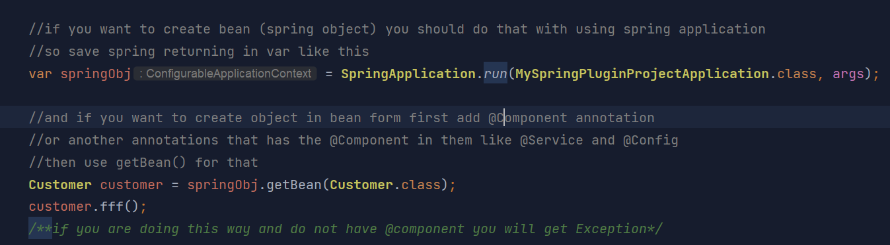

if you want to create bean (spring object) you should do that with using spring application
so save spring returning in var like this        
    
    var springObj = SpringApplication.run(MySpringPluginProjectApplication.class, args);     

and if you want to create object in bean form first add @Component annotation
or another annotations that has the @Component in them like @Service and @Config
then use getBean() for that    
		
    Customer customer = springObj.getBean(Customer.class);    
    customer.fff();   

**if you are doing this way and do not have @component you will get Exception**

************************************************************************************************************************
# DATABASE HINT:

VERY IMPORTANT

1. first you need to install mysql server and you can install that from above link
and the tutorial of that in this link too  
https://www.w3-farsi.com/posts/18452/install-mysql-server/

   
2. then you should install  MYSQL Administrator :        
   https://www.w3-farsi.com/posts/18452/install-mysql-server/

and after that you make sure you have that install base on upper link 
you can use mysql command prompt 
(i do not actually know that you can to this by normal command prompt or not)

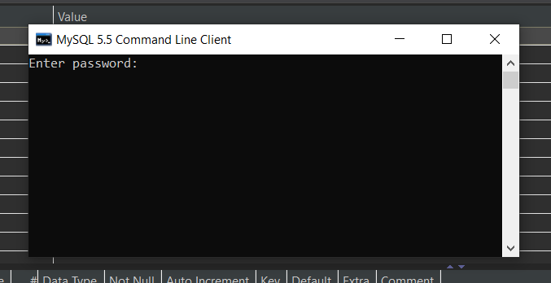

and if you enter any password  and set on that enter that or like mw have no password(blank) and just enter 
and you will see this

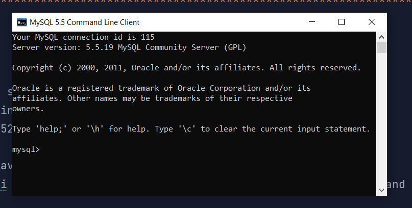

if you see this it mean you install and enter currently

3. and if you want to create and table and sql statements you can see this link:             
   https://www.w3-farsi.com/posts/18516/create-tables-and-databases-using-mysql-administrator/             
    in mysql command prompt that you install in number 1 hint paste this:     
   `CREATE DATABASE (name of your database);`     
   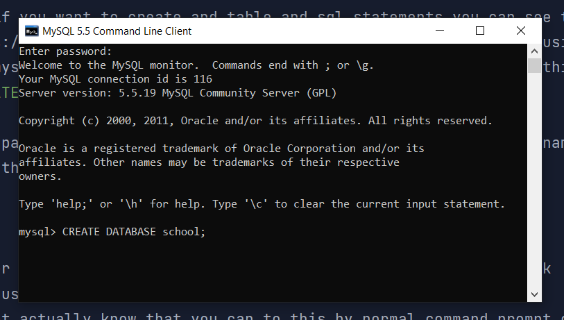
    
    for pasting better :  `CREATE DATABASE` then type your database name in mysql command prompt   
    and then type `;`
    
    and if you do it correctly you see this:
    `Query OK, 1 row affected (0.00 sec)`

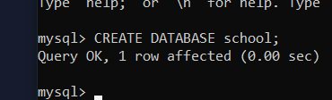

be careful if you want to have statement like adding or dropping table paste this statement
`USE University;`(be careful you should make sure you have that database)
and after that you have your statement execute on that database

### of you want better way to have and see you statement do this:
in intellij we have very spatial plugin name  :    
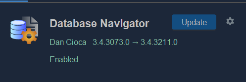

for learning sql statement see this link:    
https://www.w3schools.com/mysql/mysql_sql.asp

and you see `DB Browser` on the left I think and you can to lots of work instead in command 
prompt   
this + but is to have server connection NOT creating database     
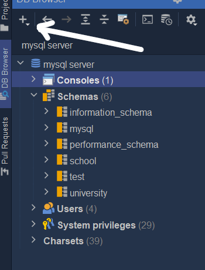  

here you can see database of mysql database

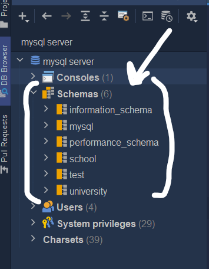      

if you want to create data base go to mysql command prompt do hint 3 
and see that in schema and this is your data base and if you
craeting new data base you refresh that and se that in schemas 
part

by right click on server and press auto-commit you can do better as instanse time
not saving every time(i think)da

### so the top name is your server not database (`mysql server`)
### and you see your database in schemas part

### or

using another app like dbeaver to have you database or mysql workbench 
i prefer dbeaver
    
     

### **mysql database**
in
#### **.properties**:

**you can check this link and copy,paste the pure code from this link:**    
#### **https://spring.io/guides/gs/accessing-data-mysql/**

how to do mysql in command prompt:    
#### **https://blog.devart.com/mysql-command-line-client.html**    

the spring git guid:    
#### **https://github.com/spring-guides/gs-accessing-data-mysql.git**

    spring.jpa.hibernate.ddl-auto=update     
    spring.datasource.url=jdbc:mysql://localhost:3306/(database or schema name ,not server name)     
    spring.datasource.username=root    (the user name of ,mysql server ,not database or schema)
    spring.datasource.password=admin    (the password of ,mysql server ,not database or schema)
    spring.datasource.driver-class-name=com.mysql.jdbc.Driver 

### **mysql database**
in
#### **.yml**:

    spring:
      profile: dev
      datasource:
        driver-class-name: com.mysql.jdbc.Driver
        password: admin
        url: jdbc:mysql://localhost:3306/dcbapp
        username: root
      jpa:
        hibernate:
          ddl-auto: update
        show-sql: true

###### but it is not working for me 

#### you can do your database settings in to format files:
* ##### .properties
* ##### .yml                

###### but be careful about how code forming you should use for them

### **h2 database** 
in  
#### **.properties**:

    spring.h2.console.enabled=true
    spring.datasource.url=jdbc:h2:mem:dcbapp
    spring.datasource.driverClassName=org.h2.Driver
    spring.datasource.username=sdr
    spring.datasource.password=1235
    spring.jpa.database-platform=org.hibernate.dialect.H2Dialect

if you see :   
_Initialized JPA EntityManagerFactory for persistence unit 'default'_   
it means it created 
not 
_No JTA platform available on top of that_   
search and be careful about site title check this 

### **search : http://localhost:(yourPort)/h2-console**   

#### **be careful about this option that you see**
###### Saved Settings: Generic H2 (Server)    
###### Setting Name:    Generic H2 (Server)    
###### Driver Class: org.h2.Driver //or maybe base on your codes up here   
###### JDBC URL:     jdbc:h2:mem:dcbapp    
###### User Name:   (u t define that)    
###### Password:    (u t define that)   

### **h2 database**
in
#### **.yml**:

**be careful about incidentals**  

    spring:        
      profile: qa         
      datasource:        
        driverClassName: org.h2.Driver       
        password: 1235        
        url: jdbc:h2:mem:dcbapp-qa       
        username: sdr      
      h2:      
        console:     
          enabled: true      
      jpa:      
        database-platform: org.hibernate.dialect.H2Dialect

************************************************************************************************************************
### if you want to change the spring banner that appear in console

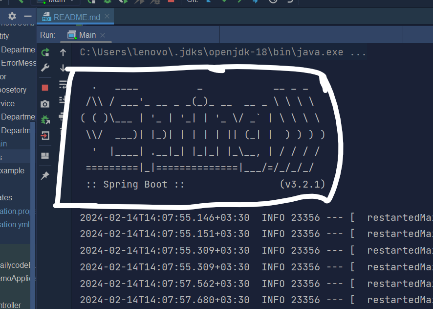

you can create `banner.txt` in `src/main/resources`

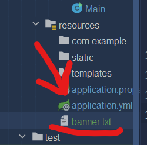

and paste your pattern
you can use this site to help yourself to have banner patterns:  
https://patorjk.com/software/taag/#p=display&f=Graffiti&t=Type%20Something%20       
like this

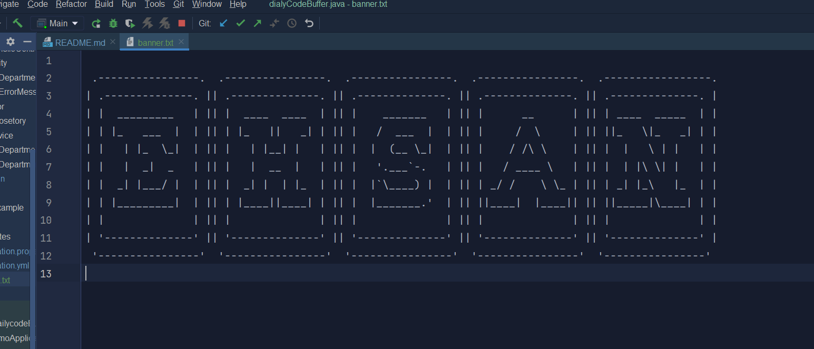

and see your console

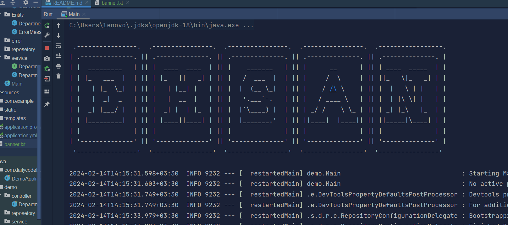
************************************************************************************************************************

## **problem solution :**

************************************************************************************************************************
if you want to use plugin of java ,and it doesn't work check `pom.xml`
and in the text find this part (maybe parent part):

    <parent>
    <groupId>org.springframework.boot</groupId>
    <artifactId>spring-boot-starter-parent</artifactId>
    <version>3.2.1.RELEASE</version>
    <relativePath/> <!-- lookup parent from repository -->
    </parent>

#### and remove `.RELEASE` from `<version>3.2.1.RELEASE</version>` to have this :

    <parent>
		<groupId>org.springframework.boot</groupId>
		<artifactId>spring-boot-starter-parent</artifactId>
		<version>3.2.1</version>
		<relativePath/> <!-- lookup parent from repository -->
	</parent>

and refresh maven by top right icon and let intellij to it work and after moment 
you have your perfect spring app 

## how to add dependency:

https://www.jetbrains.com/help/idea/spring-support.html

in `pom.xml` alt + insert in widows ot right click and click on generate to have generated frame:

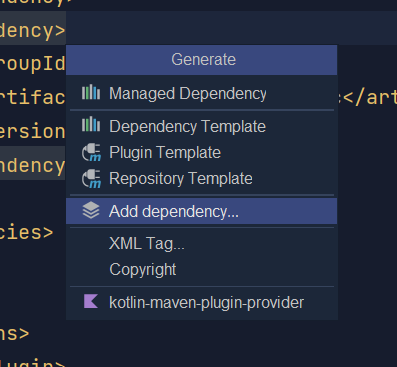

chose `add dependency` and find your dependency on the opened part in bottom

and search your dependency there

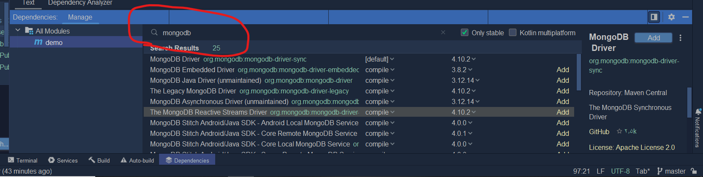

then after finding the dependency click add to add your dependency in your `pom.xml`

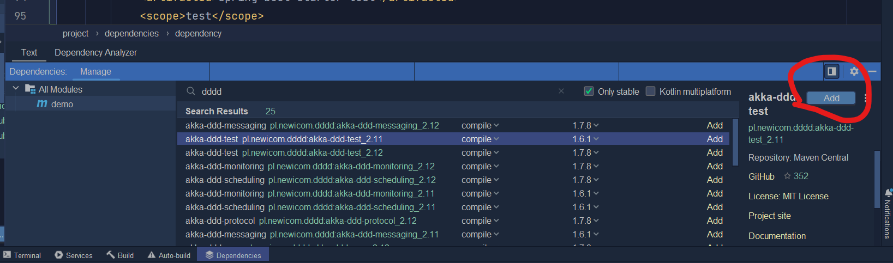

and done!!!

************************************************************************************************************************
## I had error in my pom.xml file with

    <build>
        <plugins>
            <plugin>
                     <groupId>org.springframework.boot</groupId>
                    <artifactId>spring-boot-maven-plugin</artifactId>
                </plugin>
        </plugins>
    </build>

so I add
    
    <version>${project.parent.version}</version>

in that so ia have this:

    <build>
    		<plugins>
    			<plugin>
	    			<groupId>org.springframework.boot</groupId>
	    			<artifactId>spring-boot-maven-plugin</artifactId>
	    			<version>${project.parent.version}</version>
	    		</plugin>
	    	</plugins>
	    </build>

but it fixed and I don't know how

********************************
## set spring profile in intellij 

### we can to this in 3 ways

for set profile in spring first create `application-(profile name).properties`
and in console you see this :     

    No active profile set, falling back to 1 default profile: "default"

**BECAUSE YOU DO NOT SET THAT CREATED PROFILE MANUALLY**     

#### **with edit configuration**

go to `run` >> `Edit configuration` >> `Environment Variable` paste this:  

    spring.profiles.active = <your profile name>

like this:

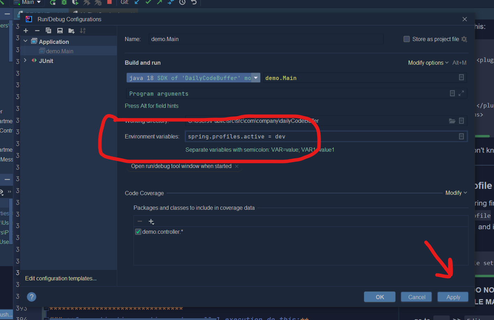

AND IT IS DONE YOU SET YOUR PROFILE !!!!

#### **with file `.properties` or `.yml` **
go to `application.properties` and paste this :

    spring.profiles.active = (profile name)
or more than one :
    
    spring.profiles.active = (profile name),(profile name),(profile name),...

your profile can be default and not create as file in `resources`

or you can go to `application.yml` and past this:

    spring:
        profiles:
            active: (profile name),(profile name),(profile name),..

### **very important point:** 
**if you have a bunch of active profile and in all of them or in most of them 
you have same variable ,and you call that same variable spring would find the latest
variable in active profile 

for example :
you create three active profile :**

    spring.profiles.active = dev,test,custom

**and variable `GGG` is in `dev` and `test` in creating active profile the
order 
spring first find `dev` and store `GGG` value in `dev` and then if it finds same name 
variable in `test` it will consider the value of `GGG` of test profile ,and it checks
next profile `custom` ,and it doesn't have `GGG` so `GGG` of test won't change by latest
or newest profile**

#### **with code and method in java classes**
using method :
    
    .setDefaultProperties(Collections.singletonMap("spring.profiles.active","(profile name)"));

I think if you want to active more do that again like (I didn't test this yet):

    .setDefaultProperties(Collections.singletonMap("spring.profiles.active","(profile name)"));
    .setDefaultProperties(Collections.singletonMap("spring.profiles.active","(profile name)"));

like :

    var app = new SpringApplication(MySpringPluginProjectApplication.class);
    app.setDefaultProperties(Collections.singletonMap("spring.profiles.active","dev"));
    var springObj = app.run(args);

and if you see your console after run you see this line :

     : The following 1 profile is active: "(profile name)",(profile name),...

********************************
## How to pass and receive data between database and server

### you can do this with **Class object** and **record object**    
both of them have pros and cons

### With CLASS
**pros:**
* mutable (you can change the value of them)

**cons:**
* you should add getter and setter method and toString and ... all essential method for your fields if you do not have them   
in yor class data value won't pass form URL (in postman and insomnia) so make sure have them in your class either codes
or by Lombok

#### INSTRUCTION:
create your class declare your filed 
**make sure you have setter method and toString and ... all essential method for your fields**

if you want to pass data in Body (in postman like here):            
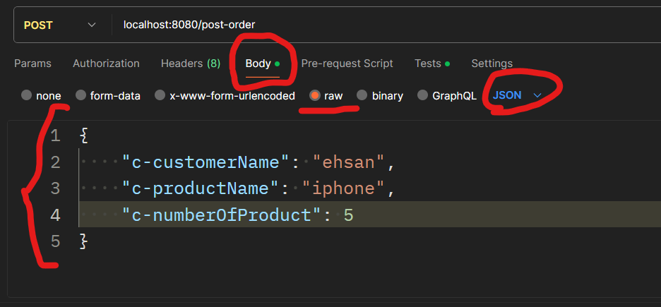

make sure in that method which control that URL and operation have **`@RequestBody`** annotation:
like :      
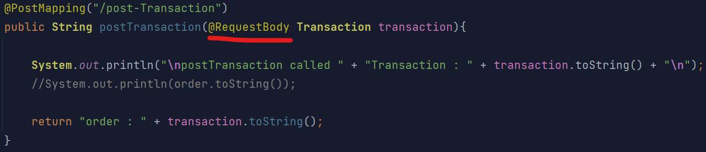

so in post man you see this in console    

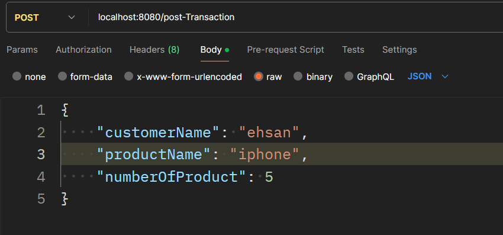

    Transaction[customerName=ehsan, productName=iphone, numberOfProduct=5]

How to pass data in proper format in postman:
set the type on `JSON`
betwen `{}`
write your filed name between `""` and without space type `:` and type your value in right format for string `""`
and for integer without `""` and don't forget about `,` between the data

make sure you pass correct name in Body 
use the name of filed exactly
if you have set @JsonBody("(name of key and header)") use "(name of key and header)" in postman

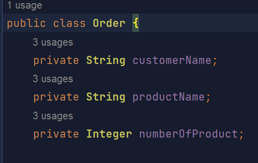

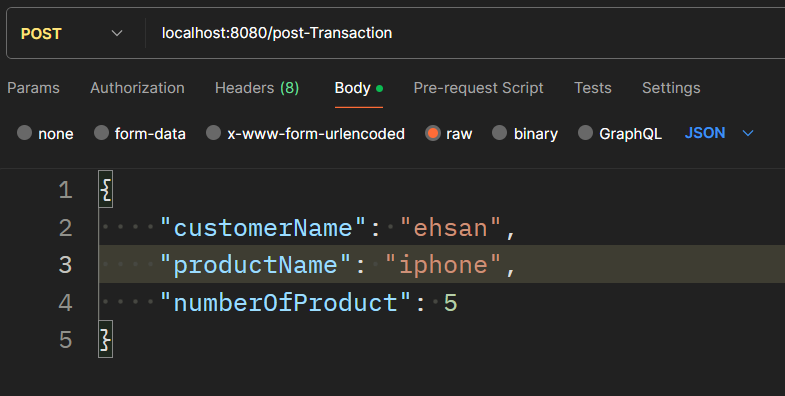

    {
        "customerName": "ehsan",
        "productName": "iphone",
        "numberOfProduct": 5    
    }

### With RECORD:

#### PROS:
* convenient (don't need to have lots of code like getter and setter and toString)

#### CONS:
* immutable  (you can't change the value of filed because the filed are final)

#### INSTRUCTION:
create record and declare your field and like object class and have `@RequestBody`

you don't need to have getter and setter and toString in your record,it will do it automatically
and pass the data in postman or insomnia like this(same ass class object):      

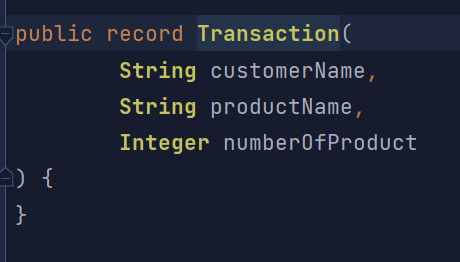

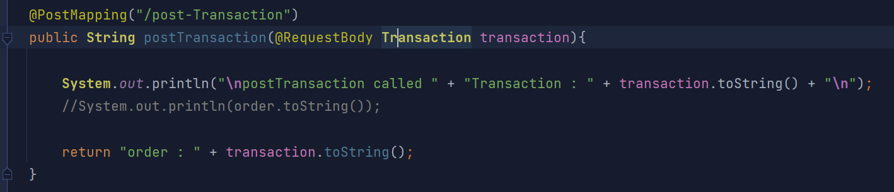
    
    {
        "customerName": "ehsan",
        "productName": "iphone",
        "numberOfProduct": 5    
    }

********************************
## **for activating runtime and parallel execution do this:**     
For IntelliJ IDEA 12+ releases we can build automatically the edited sources if we are using    
the external compiler option. The only thing needed is to check the option "Build project   
automatically", located under "Compiler" settings:

Also, if you would like to hot deploy, while the application is running or 
if you are using spring boot devtools you should enable the compiler.automake.allow.when.app.running from registry too. This will automatically compile your changes.

For versions greater than 2021.2, we need check 'Allow auto-make t o 
start even id the development application is currently running' option:

and 

for old version use this:

solution of this in :
https://stackoverflow.com/questions/12744303/intellij-idea-java-classes-not-auto-compiling-on-save

********************************
